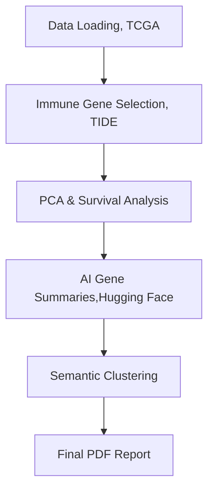

# SurvAIval

A lightweight **AI-driven survival analysis pipeline** integrating [TCGA](https://www.cancer.gov/ccg/research/genome-sequencing/tcga) expression, [TIDE](http://tide.dfci.harvard.edu/) immune metrics, and clinical data.  
Built with **Python + Snakemake**, it demonstrates reproducible data science practices for translational oncology and biomarker discovery.

---

## Key Features
- Automated **data integration** of TCGA expression and clinical metadata  
- **Principal Component Analysis (PCA)** and **Kaplan–Meier** survival stratification  
- **AI-based gene summaries** using Hugging Face large language models  
- **Semantic clustering** of gene functions and biological terms  
- Fully automated **PDF report generation** with integrated visualizations

---

##  Workflow Overview



##  Quick Start

```bash
conda env create -f environment.yml
conda activate survAIval
snakemake --cores 4
```
