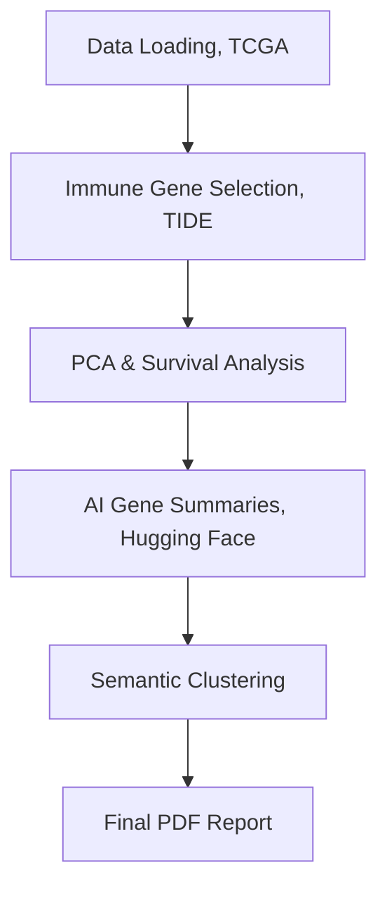

# SurvAIval

A lightweight **AI-driven survival analysis pipeline** integrating TCGA gene expression, immune metrics, and clinical data.  
Built with **Python + Snakemake**, it demonstrates reproducible data science practices for **translational oncology**, **biomarker discovery**, and **AI-assisted biological interpretation**.

---

##  Key Features

- **Automated integration** of TCGA expression and survival metadata  
- **Principal Component Analysis (PCA)** + **Kaplan–Meier** survival stratification  
- **AI-powered gene summarization** via Hugging Face LLMs  
- **Semantic clustering** of biological terms and gene functions  
- Fully automated **PDF report generation** with integrated visualizations  
- **Parameter control via config file** (`config/config.yaml`) — easily switch between cancer types (e.g., `COAD`, `LUAD`) or immune metrics (e.g., `T_Dysfunction`, `CTL_Cor`, `Risk`)

---

## Workflow Overview



##  Quick Start

```bash
git clone https://github.com/obegik/SurvAIval.git
cd SurvAIval
conda env create -f environment.yml
conda activate survAIval
snakemake --cores 4
```
Results will be saved in a report format in results folder

##  Configuration

All pipeline parameters are defined in config/config.yaml.
You can modify these fields to analyze a different cancer type or immune metric:
# -------- Global Config --------
cancer_type: "COAD"          # TCGA cancer code (e.g., COAD, LUAD, BRCA, etc.)
cancer_name: "Colorectal"    # Immune metric table name
metric: "T_Dysfunction"      # Immune metric: T_Dysfunction, CTL_Cor, Risk, Risk_adj
top_n: 500                   # Number of top immune genes to include
outlier_z_threshold: 3       # PCA z-score cutoff for outlier removal


##  Data Sources & References

This pipeline integrates open-access datasets and resources:
	•	TCGA Pan-Cancer Atlas — RNA-seq expression and clinical data from the UCSC Xena Data Portal
	•	Goldman et al., Cell 2020. DOI: 10.1016/j.cell.2020.02.010
	•	TIDE (Tumor Immune Dysfunction and Exclusion) — immune dysfunction metrics used for stratification
	•	Jiang et al., Nature Medicine 2018. DOI: 10.1038/s41591-018-0136-1

    
##  Methods Summary

|  Step |  Description |
|:--|:--|
| **1. Data Loading** | Downloads TCGA RNA-seq and survival metadata via UCSC Xena |
| **2. Immune Gene Selection** | Selects top immune-associated genes based on chosen metric |
| **3. PCA & Survival Modeling** | Computes PC1 and performs Kaplan–Meier stratification |
| **4. AI Gene Summaries** | Uses Hugging Face models to summarize gene functions |
| **5. Semantic Clustering** | Clusters gene summaries using BioBERT embeddings, UMAP, and HDBSCAN |
| **6. Report Generation** | Combines all plots and tables into a reproducible PDF report |
